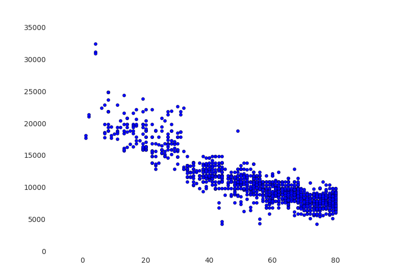
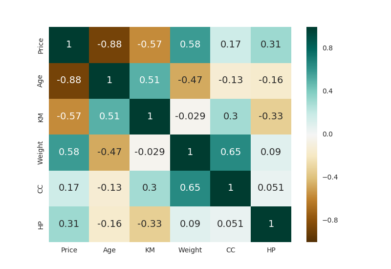

## 基本数据探索-数据清理和相关性分析

### 从CSV文件加载数据到Azure Databricks

**步骤一：** 从本地上次CSV文件，将CSV数据转换为数据表（下载使用的 [CSV文件](static/UsedCars.csv)）。

CSV数据表的结构如下：

```
root
 |-- Price: string (nullable = true)
 |-- Age: string (nullable = true)
 |-- KM: string (nullable = true)
 |-- FuelType: string (nullable = true)
 |-- HP: string (nullable = true)
 |-- MetColor: string (nullable = true)
 |-- Automatic: string (nullable = true)
 |-- CC: string (nullable = true)
 |-- Doors: string (nullable = true)
 |-- Weight: string (nullable = true)
```

**步骤二：** 创建Spark DataFrame对象进行数据分析。

在Notebook中使用SQL语句查询数据表

```sql
%sql
select * from usedcars_csv
```

使用`spark.sql()`方法定义DataFrame对象

```sql
df = spark.sql("select * from usedcars_csv")
```

### 简单数据探索

使用`show()`方法显示数据。

```sql
df.show()
```

使用`count()`方法显示数据表中行数。

```sql
df.count()
```

**注意：** 假设`df.count()`的输出为1446

使用`head(n)`方法输出前n条数据项。

```python
df.head(10) # 与使用df.show(10)类似，只不过：head以json格式显示，show以表格的形式显示
```

使用`dtypes`属性查看schema定义。

```python
df.dtypes  # 这个是一个属性而不是方法，与使用df.printSchema()方法类似，只不过：dtypes以json格式显示，.printSchema()以树状结构显示
```

使用`describe()`获取数据统计: 行数(项目数)，最大值，最小值，方差，标准差。

```python
summary = df.describe()
display(summary)

# 对某一特定列进行数据统计
display(df.describe("Price"))
```

从数据统计中，是可以得出哪些列是有数据缺失的，那么，如何得出哪些列是有数据缺失的？缺失的数据是多少？

**注意：** 记得在前几个命令中通过`df.count()`获取的输出吗！把summary中每一列在count行的值和df.count()的值进行比较，有差异的即为存在数据缺失的列，差异额即为当前列缺失数据的数量。

### 数据清理

在Price的类型为string时， 方差的值大于最大值，是不正确的，需要将数据表的列转换为更准确的数据类型。

```python
# 将默认的string类型转换为integer, FuelType仍然保留为string

df_typed = spark.sql("select cast(Price as int), cast(Age as int), cast(KM as int), FuelType, cast(HP as int), cast(Automatic as int), cast(CC as int), cast(Doors as int), cast(Weight as int) from usedcars_csv")
```

重新获取数据统计。

```python
# 在Price的类型为string时， 方差的值大于最大值，是不正确的。在Price的类型转成int以后，方差和最大值的数据变得正确了

display(df_typed.describe())
```

清理FuelType列的值，将值标准化为特定的几个值。

```python
# 查看FuelType列中的不重复的值

display(df_typed.select("FuelType").distinct())

# 使用replace将FuelType的值标准化 Diesel > diesel, Petrol > petrol, CompressedNaturalGas / methane / CNG > cng

df_cleaned_fueltype = df_typed.na.replace(["Diesel","Petrol","CompressedNaturalGas","methane","CNG"],["diesel","petrol","cng","cng","cng"],"FuelType")
```

查看标准化后，FuelType的值。

```python
display(df_cleaned_fueltype.select("FuelType").distinct())
```

清理空数据，使用drop处理Price列， Age列和KM列的缺失数据。

```python
# 使用drop处理Price列， Age列和KM列的缺失数据

df_cleaned_of_nulls = df_cleaned_fueltype.na.drop("any", subset=["Price", "Age", "KM"])
display(df_cleaned_of_nulls.describe())
```

将清理后的DataFrame对象持久化为新的数据表，供后续数据分析使用。

```python
# 将清理后的DataFrame对象持久化为新的数据表，供后续数据分析使用

df_cleaned_of_nulls.write.mode("overwrite").saveAsTable("usedcars_clean")
```

### 数据相关性分析

筛选出柴油车的DataFrame。

```python
# 筛选出柴油车的DataFrame
dieselDF = df_cleaned_of_nulls.filter("FuelType = 'diesel'")

display(dieselDF)
```

使用`df.toPandas()`将Spark DataFrame转换为Pandas DataFrame进行数据的可视化分析。

```python
# 将Spark DataFrame转换为Pandas DataFrame

pdf = df_cleaned_of_nulls.toPandas()
```

分析柴油车，车龄与价格的关系

```python
# 使用Python matplotlib和Pandas画出年龄和价格的关系图

import matplotlib.pyplot as plt
import numpy as np
import seaborn as sns

fig, ax = plt.subplots()
ax.scatter(pdf.Age, pdf.Price)
display(fig)
```



使用`df.corr()`分析各因素的相关性。

```python
# 使用df.corr()分析各列的相关性

# Run this cell and a very nice matrix will hopefully appear
fig2, ax = plt.subplots()
sns.heatmap(pdf[['Price','Age', 'KM', 'Weight', 'CC', 'HP']].corr(),annot=True, center=0, cmap='BrBG', annot_kws={"size": 14})
display(fig2)
```


